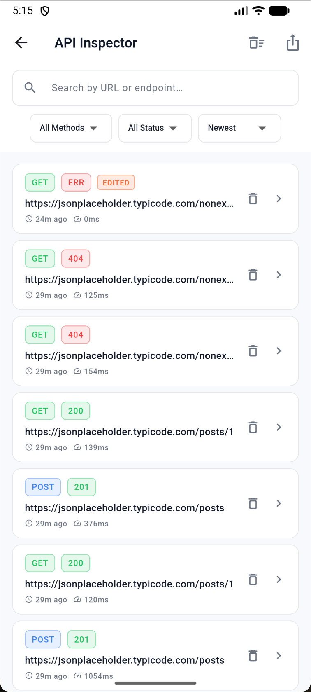
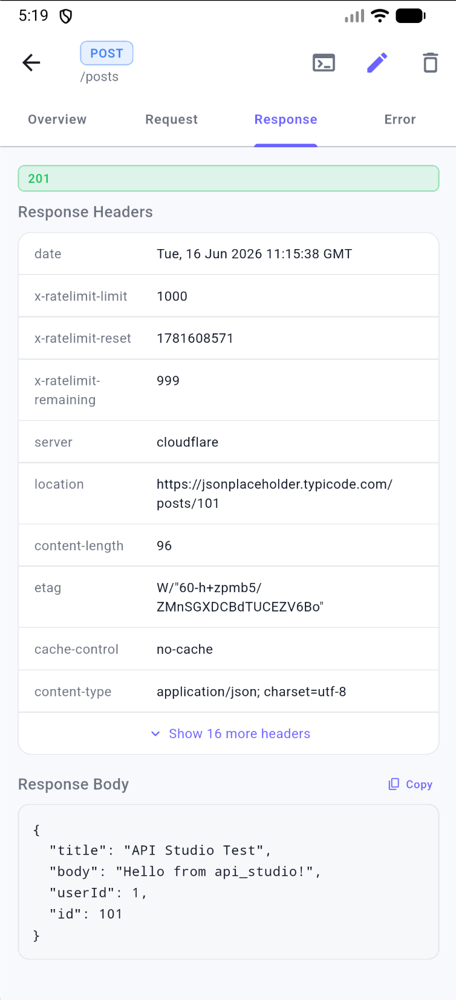
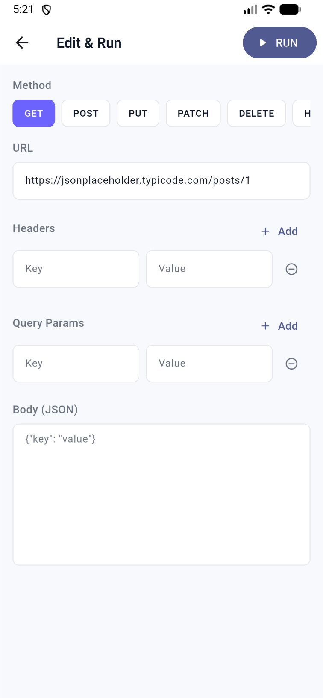
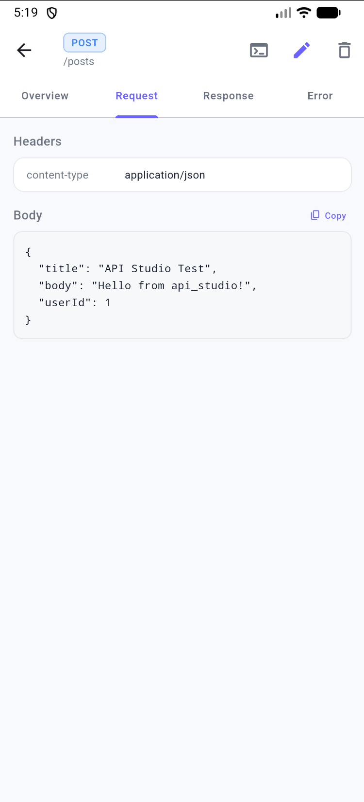
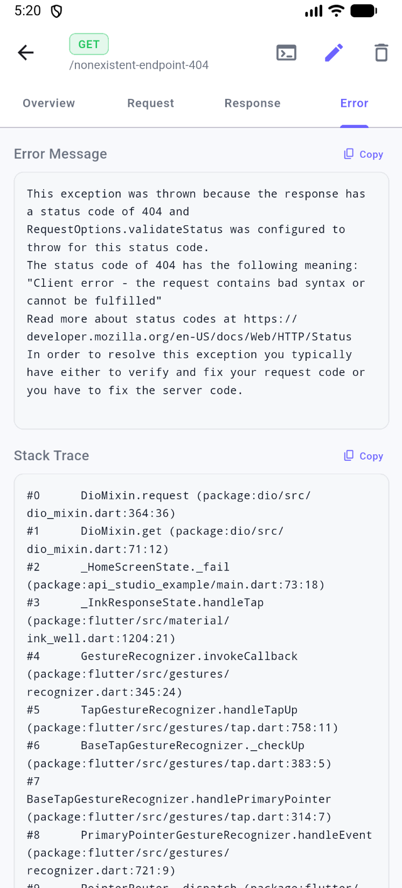
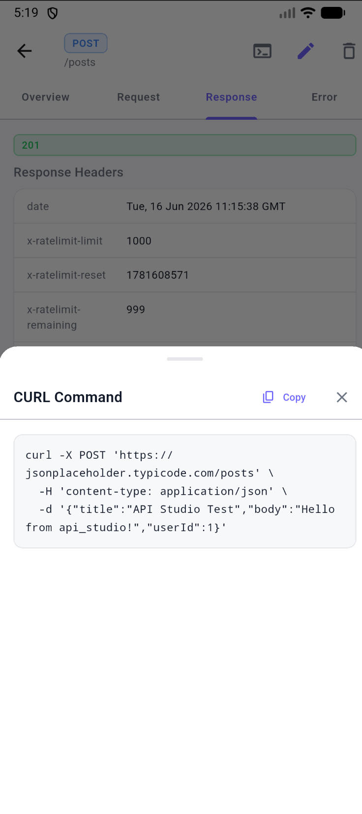

# API Studio

<p align="center">
  
  
  
</p>

A powerful **in-app API debugging and inspection tool** for Flutter — like Charles Proxy, Chucker, and Alice — built specifically for [Dio](https://pub.dev/packages/dio).

Zero configuration. Drop it in, add one interceptor, and every HTTP request your app makes is captured, stored, and browsable — without leaving the app.

---

## Features

| | |
|---|---|
| 🔍 **Auto-capture** | Intercepts all Dio requests — URL, method, headers, body, query params, form data, multipart |
| 💾 **Persistent logs** | Powered by Hive — logs survive hot restart, app restart, and device reboots |
| 📊 **Inspector dashboard** | Search, filter by method/status, sort — handles 10,000+ logs smoothly |
| 🗂 **Detail view** | Overview / Request / Response / Error tabs with copy buttons on every section |
| ✏️ **Edit & Run** | Modify any captured request and re-execute it — original log is never mutated |
| 🧾 **CURL generator** | One tap to copy or share any request as a `curl` command |
| 📤 **Export** | Export all logs as JSON or TXT and share via share sheet |
| 🎨 **Themeable** | Full light/dark support + `ApiInspectorThemeData` for custom colors and radius |
| ⚙️ **Configurable** | Pass `maxStoredLogs` and `requestTimeout` from the parent app |

---

## Screenshots

<p align="center">
  
  
  
</p>
<p align="center">
  
  
  
</p>

---

## Installation

Add to your `pubspec.yaml`:

```yaml
dependencies:
  api_studio: ^0.0.1
```

Then run:

```sh
flutter pub get
```

---

## Setup

### Step 1 — Initialise before `runApp`

```dart
import 'package:api_studio/api_studio.dart';

Future<void> main() async {
  WidgetsFlutterBinding.ensureInitialized();
  await ApiStudio.init();
  runApp(const MyApp());
}
```

### Step 2 — Add the interceptor to your Dio instance

```dart
final dio = Dio();
dio.interceptors.add(ApiStudio.interceptor);
```

### Step 3 — Open the inspector

Trigger it from any button, FAB, or shake gesture:

```dart
ApiStudio.show(context);
```

That's it. Every request made through that `Dio` instance is now captured and browsable.

---

## Full Example

```dart
import 'package:api_studio/api_studio.dart';
import 'package:dio/dio.dart';
import 'package:flutter/material.dart';

Future<void> main() async {
  WidgetsFlutterBinding.ensureInitialized();
  await ApiStudio.init();

  final dio = Dio();
  dio.interceptors.add(ApiStudio.interceptor);

  runApp(const MyApp());
}

class MyApp extends StatelessWidget {
  const MyApp({super.key});

  @override
  Widget build(BuildContext context) {
    return MaterialApp(
      home: Scaffold(
        appBar: AppBar(
          title: const Text('My App'),
          actions: [
            IconButton(
              icon: const Icon(Icons.bug_report_rounded),
              onPressed: () => ApiStudio.show(context),
            ),
          ],
        ),
      ),
    );
  }
}
```

See the complete working example in the [`/example`](example/) folder.

---

## Configuration

All parameters are optional — defaults are used if not provided.

```dart
await ApiStudio.init(
  // Maximum number of logs to keep on disk (oldest are pruned automatically)
  maxStoredLogs: 500,           // default: 10,000

  // Timeout applied to re-run requests from Edit & Run
  requestTimeout: Duration(seconds: 15),  // default: 30s

  // Custom theme
  theme: ApiInspectorThemeData(
    primaryColor: Colors.teal,
    borderRadius: 16,
  ),
);
```

---

## Theming

```dart
// Light (default)
const ApiInspectorThemeData()

// Dark
ApiInspectorThemeData.dark()

// Match the app's brightness automatically
ApiInspectorThemeData.fromBrightness(Theme.of(context).brightness)

// Fully custom
ApiInspectorThemeData(
  primaryColor: Color(0xFF6C63FF),
  backgroundColor: Colors.white,
  surfaceColor: Colors.white,
  cardColor: Colors.white,
  borderRadius: 12.0,
  isDark: false,
)
```

You can also pass a theme per `show()` call — overrides the init-time theme for that session:

```dart
ApiStudio.show(
  context,
  theme: ApiInspectorThemeData.dark(),
);
```

---

## Edit & Run

Open any captured request → tap the **pencil icon** → **Edit & Run**:

1. All fields are pre-filled with the original request data
2. Modify URL, HTTP method, headers, query params, or body
3. Tap **RUN** — a new log is created and tagged with an **EDITED** badge
4. The original log is never modified

---

## Architecture

Built with Clean Architecture + SOLID principles:

```
lib/src/
├── core/           ← Constants, errors, extensions, use-case base, utils
├── domain/         ← Entities, repository interfaces, use cases (pure Dart)
├── data/           ← Hive models, TypeAdapter, datasource, repo impl, interceptor
├── presentation/   ← BLoC × 4, screens × 3, widgets × 7
├── theme/          ← ApiInspectorTheme, AppColors, AppTextStyles, Dimensions
└── services/       ← DiService (DI wiring), ExportService
```

| Concern | Solution |
|---|---|
| State management | `flutter_bloc` — feature-scoped BLoCs, Equatable states |
| Storage | Hive + generated TypeAdapter, 10k+ logs with pagination |
| Performance | `ListView.builder`, `RepaintBoundary` per card, `buildWhen` guards |
| Interception | Dio `Interceptor` — captures request / response / error phases |
| CURL export | Pure Dart utility, zero extra dependencies |
| Theming | `InheritedWidget`-based `ApiInspectorTheme` |

---

## Requirements

| | Minimum |
|---|---|
| Flutter | 3.19+ |
| Dart | 3.3+ |
| Dio | 5.x |
| Platforms | Android, iOS, macOS, Linux, Windows, Web |

---

## Running the Example App

```sh
cd example
flutter pub get
flutter run
```

Tap the **bug icon** (🐛) in the app bar to open the inspector.

---

## Running Tests

```sh
flutter test
```

After changing the Hive model, regenerate the adapter:

```sh
dart run build_runner build --delete-conflicting-outputs
```

---

## Contributing

- Follow the existing Clean Architecture layering — keep domain layer free of Flutter/Hive imports
- File bugs via the issue tracker
- PRs welcome

---

## License

MIT
