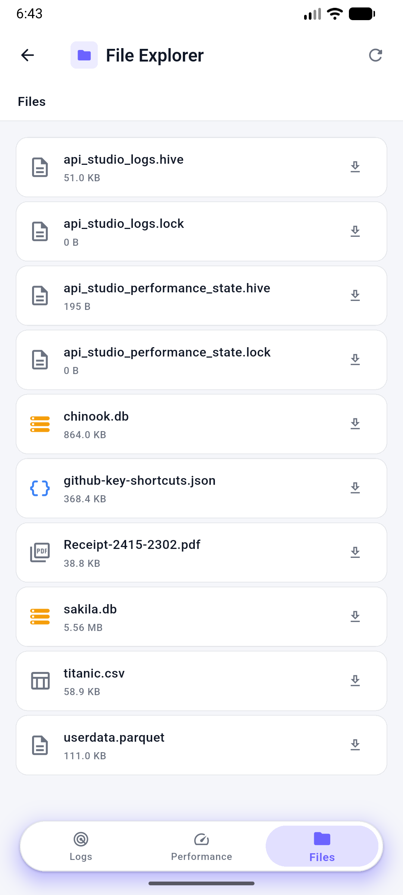
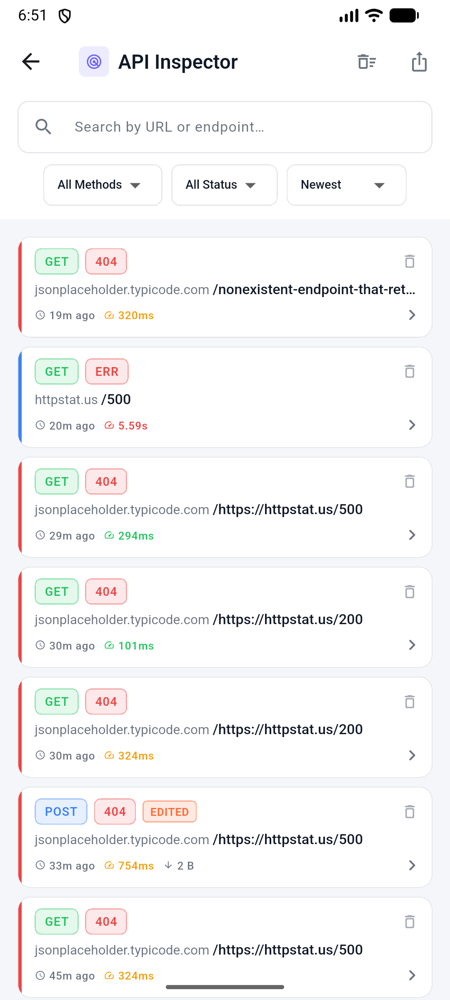
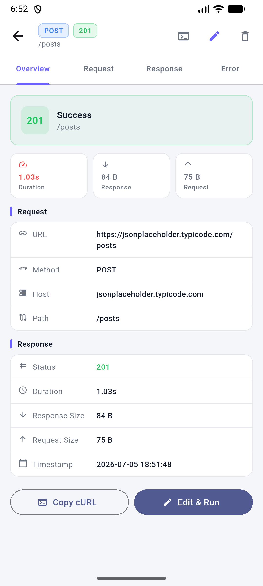
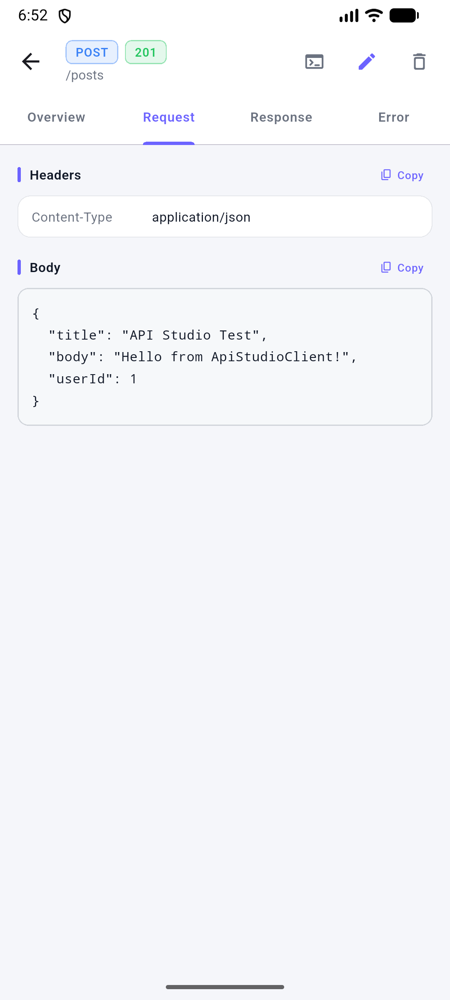
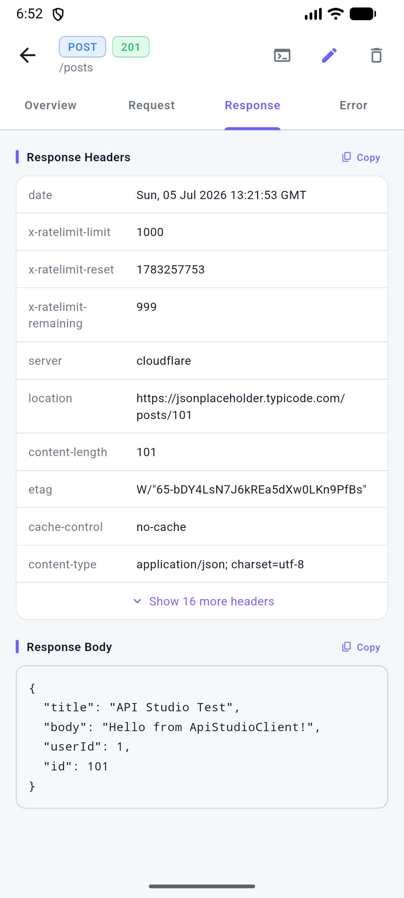
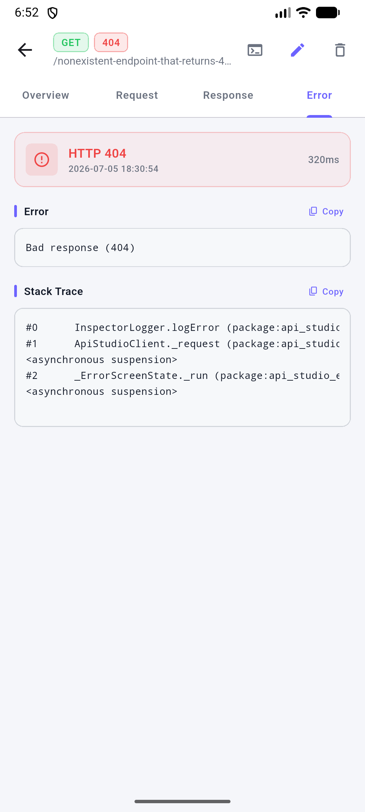

<h1 align="center">API Studio</h1> 
 Build • Debug • Monitor • Analyze APIs from a Single Toolkit 
 

🚀 Overview

API Studio is a modern networking and API debugging toolkit built exclusively for Flutter developers.

It brings networking, API inspection, request monitoring, connectivity tracking, debugging utilities, and application file management together in a single developer-focused toolkit.

Whether you're building a personal project or a production application, API Studio helps you understand, debug, test, and monitor your application's network layer with minimal setup.

✨ Why API Studio?

API Studio goes beyond simply sending HTTP requests.

With API Studio, you can:

🌐 Send and manage HTTP requests
📡 Automatically inspect API traffic
📊 Monitor requests and responses
🔍 Debug request and response details
🌍 Track internet connectivity in real time
📈 Monitor failed API requests
📝 Generate cURL commands
📤 Export API logs
⚡ Edit and retry requests
📁 Browse and manage application files

Everything is designed to work together as a lightweight developer toolkit.

🌐 Networking

API Studio provides a built-in HTTP client with support for:

GET
POST
PUT
PATCH
DELETE
HEAD
OPTIONS
Multipart Upload
File Download
Custom Headers
Query Parameters
Authorization
Request Timeout
Retry Requests
Base URL Configuration
📡 Automatic API Interceptor

API Studio can automatically capture API requests and make them available inside the API Inspector.

Captured information includes:

URL
HTTP Method
Headers
Request Body
Query Parameters
Response
Status Code
Response Time
Error Details
Stack Trace

No additional configuration is required for local API inspection.

📱 API Inspector

A developer-focused interface for inspecting and debugging API traffic.

Features include:

🔍 Search Requests
🔽 Filter by HTTP Method
🔽 Filter by Status
📋 Request Details
📄 Response Viewer
⚠️ Error Viewer
📝 JSON Formatter
📋 Copy Request & Response
🗑️ Delete Logs
⚡ Edit & Retry
📝 Generate cURL
🌍 Internet Monitoring

Monitor your application's internet connectivity in real time.

Features include:

Current Internet Status
Internet Status Stream
Connectivity Listener
Live Status Updates

Get the current connectivity status:

ApiStudio.internetStatus

Listen for connectivity changes:

ApiStudio.internetStream.listen((status) {
  // Handle connectivity changes
});
📈 Live Streams

API Studio provides streams that can be used to build real-time monitoring experiences.

Available streams include:

Internet Connectivity
Failed API Count
Request Updates

Example:

ApiStudio.failedApiCountStream.listen((count) {
  // Update your UI
});
📝 cURL Generator

Generate ready-to-use cURL commands directly from intercepted requests.

Useful for:

Backend Teams
QA Testing
API Sharing
Terminal Testing
Debugging
📤 Export Logs

Export API request history for debugging, sharing, or documentation.

Supported formats:

JSON
PDF
⚡ Edit & Retry

Modify intercepted requests directly from the API Inspector and retry them without changing your application code.

You can modify:

Headers
Query Parameters
Request Body

Then execute the request again instantly.

📁 File Explorer

API Studio includes a lightweight File Explorer that allows developers and testers to browse application files and folders directly from the app.

Features
📂 Browse folders and files
🧭 Breadcrumb navigation
↗️ Open files using the platform's external/default handler
⬇️ Download files
📱 Platform-aware file handling
⚡ Lightweight implementation with no internal file parsing or file viewer

The File Explorer does not attempt to render or parse file contents. File opening is delegated to the underlying platform, allowing users to use the appropriate application or browser handler available on their device.

Open it with:

ApiStudio.showFileExplorer(context);
📸 File Explorer

  

📸 Screenshots

    
 
   

📦 Installation

Add API Studio to your project:

dependencies:
  api_studio: ^1.0.1

Then run:

flutter pub get
🚀 Quick Start

Initialize API Studio:

await ApiStudio.initialize();
📊 Automatic API Logging

Automatic remote API logging is optional.

Pass an API key to send API execution logs to the API Studio backend:

await ApiStudio.initialize(
  apiKey: 'YOUR_API_KEY',
);

Without an API key, remote logging remains disabled.

Key characteristics:

Fire-and-forget logging
Never blocks or delays API requests
Logging failures never throw
Sensitive headers are stripped before upload
API configuration and retry logic remain untouched
Logging requests are isolated from application API traffic

Sensitive headers removed before upload include:

Authorization
Cookie
Set-Cookie
X-API-Key
Proxy-Authorization
🌐 HTTP Client

Create an API Studio client:

final client = ApiStudioClient();
GET
final response = await client.get("/posts");
POST
await client.post(
  "/login",
  data: {
    "email": "john@example.com",
    "password": "123456",
  },
);
PUT
await client.put("/users/1");
DELETE
await client.delete("/users/1");

Requests made through the client are automatically available in the API Inspector.

📱 Open API Inspector
ApiInspector.show(context);

Inspect API requests and responses in real time.

🎯 Features at a Glance
Feature	Description
🌐 HTTP Client	Make API requests directly from Flutter
📡 API Interceptor	Automatically capture API traffic
📱 API Inspector	Debug requests and responses
⚡ Edit & Retry	Modify and retry intercepted requests
📝 cURL Generator	Generate ready-to-use cURL commands
🌍 Connectivity	Monitor internet status in real time
📈 Live Streams	React to API and connectivity changes
📤 Export Logs	Export request history as JSON/PDF
📁 File Explorer	Browse, open and download application files
📄 License

MIT License

 Made with ❤️ for the Flutter Community 
