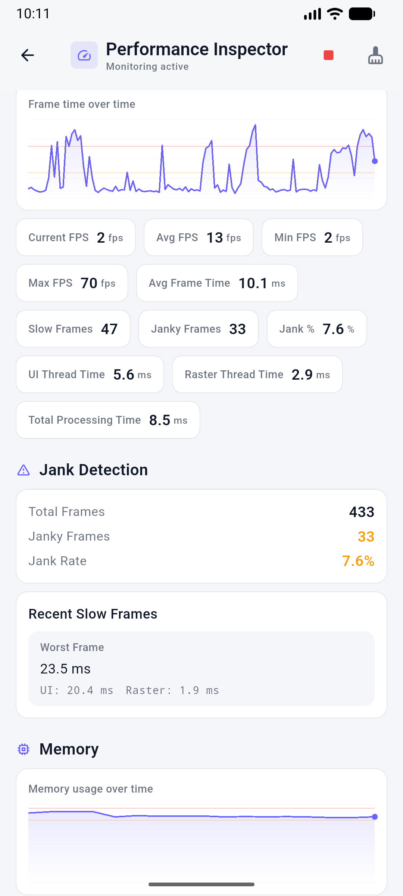

[](https://pub.dev/packages/api_studio)
[](https://flutter.dev)
[](LICENSE)

<h1 align="center">API Studio</h1>

<p align="center">
  A powerful all-in-one Flutter developer toolkit for<br>
  <strong>API Debugging • Monitoring • Testing • Performance Analysis • Developer Utilities</strong>
</p>

API Studio embeds a full HTTP client, a real-time API inspector, a lightweight performance monitor, and a file explorer directly inside your running app. It's built for Flutter developers and QA engineers who need to debug network traffic, replay requests, and check performance without leaving the app or reaching for external tooling.

---

## ✅ Features at a Glance

| Feature | Status |
|---|:---:|
| Unified Navigation (`ApiStudio.showNavigation()`) | ✅ |
| HTTP Client (GET / POST / PUT / PATCH / DELETE / HEAD / OPTIONS) | ✅ |
| Automatic API Inspector | ✅ |
| Optional Remote API Logging | ✅ |
| Connectivity Monitoring | ✅ |
| Failed API Monitoring | ✅ |
| cURL Generator | ✅ |
| Edit & Run (modify + replay requests) | ✅ |
| Export Logs (JSON / TXT) | ✅ |
| File Explorer | ✅ |
| Performance Inspector | ✅ |
| Optional Remote Performance Telemetry | ✅ |

---

## 📸 API Studio in Action

<p align="center">
  
  
  
</p>
<p align="center"><sub>API Inspector list · Request detail · Performance Inspector</sub></p>

---

## Everything you need to debug your Flutter app

### 🌐 API Client

A built-in HTTP client, wired directly into the API Inspector — every request made through it is captured automatically.

| Capability | Supported |
|---|:---:|
| GET / POST / PUT / PATCH / DELETE / HEAD / OPTIONS | ✅ |
| Multipart uploads | ✅ |
| File downloads | ✅ |
| Custom headers | ✅ |
| Query parameters | ✅ |
| Authorization | ✅ |
| Request timeout | ✅ |
| Retry policy | ✅ |
| Base URL configuration | ✅ |

```dart
await ApiStudio.initialize(
  baseUrl: 'https://api.example.com',
  enableApiClient: true, // default
);

final response = await ApiStudioClient.instance.get('/posts');

await ApiStudioClient.instance.post(
  '/login',
  data: {'email': 'john@example.com', 'password': '123456'},
);
```

### 📡 API Inspector

Every request made through `ApiStudioClient` is captured automatically — no extra configuration required.

- Request/response headers, body, and query parameters
- Status code and response time
- Error details and stack traces
- Search by URL/endpoint
- Filter by HTTP method and status
- JSON formatting with copy-to-clipboard
- Delete individual logs

```dart
ApiStudio.show(context);
```

<p align="center">
  
  
  
</p>
<p align="center">
  
  
</p>
<p align="center"><sub>List · Overview · Request · Response · Error</sub></p>

### 📤 Optional Remote API Logging

Pass an API key to also forward API execution logs to the API Studio backend:

```dart
await ApiStudio.initialize(apiKey: 'YOUR_API_KEY');
```

- Optional — remote logging stays fully disabled without a key
- Fire-and-forget — never blocks or delays your requests
- Logging failures are swallowed silently and never throw
- Sensitive headers (`Authorization`, `Cookie`, `Set-Cookie`, `X-API-Key`, `Proxy-Authorization`) are stripped before upload
- Recursive-logging protection — requests to the logging backend itself are never re-logged

### 🌍 Connectivity Monitoring

```dart
await ApiStudio.initialize(enableConnectivityStream: true);

final isOnline = await ApiStudio.isInternetConnected();

ApiStudio.internetConnectivityStream.listen((isOnline) {
  // React to connectivity changes
});
```

> `internetConnectivityStream` requires `enableConnectivityStream: true` during initialization. `isInternetConnected()` always works as a one-off check, regardless of that flag.

### 📈 Failed API Monitoring

```dart
await ApiStudio.initialize(enableFailedApiStream: true);

final failedCount = ApiStudio.failedApiCount;

ApiStudio.failedApiCountStream.listen((count) {
  // Update a badge, trigger an alert, etc.
});
```

### 📝 cURL Generator

Every captured request can be converted into a ready-to-use cURL command — useful for sharing with backend teams, QA testing, or debugging from a terminal.

### � Export Logs

Export the full request history for sharing or offline review:

- JSON
- Plain text (TXT)

### ⚡ Edit & Run

Modify an intercepted request — headers, query parameters, or body — directly from the API Inspector, then run it again instantly without touching your application code.

### 📁 File Explorer

A lightweight, read-only browser for application-internal files and folders — handy for QA and debugging without a native file manager.

- Browse folders and files with breadcrumb navigation
- Open files externally using the platform's default handler (file opening is delegated entirely to the OS; API Studio does not render or parse file contents)
- Download files with platform-aware behavior — system Downloads folder on Android/desktop, share sheet on iOS
- Download confirmation dialog with success/failure feedback
- Graceful fallback to download when external opening isn't available

```dart
ApiStudio.showFileExplorer(context);
```

<p align="center"></p>

### ⚡ Performance Inspector

A lightweight, in-app performance monitor — no external profiler required.

- FPS — current, average, minimum, maximum
- Frame time, janky frames, jank rate
- UI thread time, raster thread time
- Memory usage and peak memory *(availability depends on platform)*
- App startup phase timing
- Per-screen performance tracking
- Performance timeline with event history
- Overall performance health score with a descriptive grade
- Start/stop and clear recording sessions
- Animated, real-time graphs with smooth metric transitions

```dart
ApiStudio.showPerformanceInspector(context);

// Or drive it programmatically:
ApiStudio.startPerformanceMonitoring();
ApiStudio.stopPerformanceMonitoring();
```

<p align="center"></p>

### 📊 Performance Monitoring (Remote Telemetry)

Optionally upload **aggregated** performance snapshots to the API Studio backend, so you can track app health over time without leaving your own analytics stack out of the loop.

```dart
await ApiStudio.initialize(
  apiKey: 'YOUR_API_KEY',
  enablePerformanceMonitoring: true,
);
```

- **Disabled by default** (`enablePerformanceMonitoring: false`) — with no `apiKey`/flag, zero performance network calls are ever made.
- Performance metrics (FPS, frame time, jank, memory, startup, health score) are collected **locally** using the existing Performance Inspector engine — nothing new to configure.
- An aggregated snapshot is uploaded **at most once per hour** — never every few seconds, never on every snapshot.
- The one-hour interval is persisted locally and **survives app restarts**.
- Uses the exact same `apiKey` and backend already configured for [Optional Remote API Logging](#-optional-remote-api-logging) — no second API key, no second base URL.
- Fire-and-forget — a failed performance upload never affects, delays, or throws for your normal API requests.

Conceptually, this uploads to:

```text
POST /api/v1/performance
```

---

## 📦 Installation

```yaml
dependencies:
  api_studio: ^1.0.3
```

```bash
flutter pub get
```

## 🚀 Quick Start

Configure everything — API key, backend base URL, and the built-in API
Client — through a single unified call, then open the entire toolkit from a
single entry point:

```dart
Future<void> main() async {
  WidgetsFlutterBinding.ensureInitialized();
  await ApiStudio.initialize(
    apiKey: 'YOUR_API_KEY',       // optional
    baseUrl: 'https://example.com',
    enableApiClient: true,
  );
  runApp(const MyApp());
}
```

Then, anywhere inside your widget tree:

```dart
ApiStudio.showNavigation(context);
```

This opens a single **API Studio** screen with **API Logs**, **Performance**
and **File Explorer** all accessible through a floating bottom navigation
bar — no need to push each screen separately.

### `enableApiClient`

Controls whether the built-in [`ApiStudioClient`](#-api-client) is wired up.
Defaults to `true` for backward compatibility. Set it to `false` if you don't
plan to use `ApiStudioClient` — API Logs and Performance keep working
normally either way, and no client-related controller, logger or network
service is created.

### Opening individual screens (still supported)

The individual screens remain available if you need a specific one instead
of the full navigation:

```dart
ApiStudio.show(context);                     // API Inspector (Logs)
ApiStudio.showFileExplorer(context);         // File Explorer
ApiStudio.showPerformanceInspector(context); // Performance Inspector
```

### Migration from separate initialization calls

Previously, the API Client required a second initialization call:

```dart
// Deprecated — still works, but prefer the unified call below.
await ApiStudio.initialize(apiKey: 'YOUR_API_KEY');
ApiStudio.initClient(baseUrl: 'https://api.example.com');
```

`ApiStudio.initClient` is now `@Deprecated` and delegates to the same
underlying client setup. Prefer passing `baseUrl` and `enableApiClient`
directly to `ApiStudio.initialize` instead.

## 📄 License

MIT License

<p align="center">Made with ❤️ for the Flutter community</p>